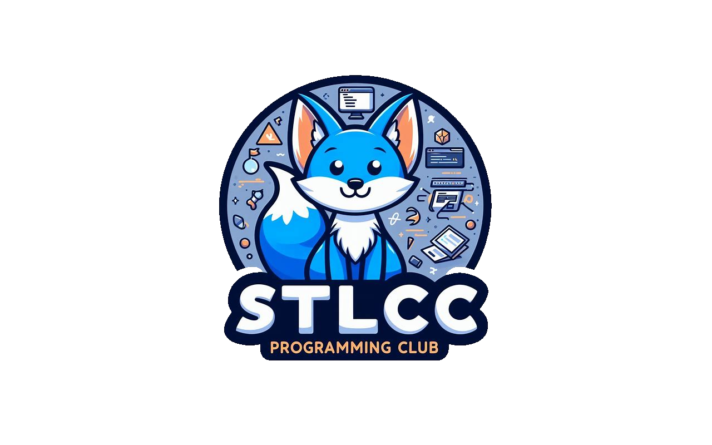

 

  

  <h3 align="center">STLCC-Site</h3>

  

    A open sourced website for STLCC's Programming club for students to gain their first contribution to an open source project!
     
     
    <a href="https://github.com/kccup/CC-Site"><strong>Explore the docs »</strong></a>
     
     
    <a href="pclub.pages.dev">View Demo</a>
    .
    <a href="https://github.com/kccup/CC-Site/issues">Report Bug</a>
    .
    <a href="https://github.com/kccup/CC-Site/issues">Request Feature</a>
  

     

## Table Of Contents

* [About the Project](#about-the-project)
* [Built With](#built-with)
* [Usage](#usage)
* [Contributing](#contributing)
* [Tools & Resources](#tools-and-resources)
* [License](#license)
* [Authors](#authors)
* [Acknowledgements](#acknowledgements)

## About The Project

A fun way to learn about Git / Github and how to contribute to open sourced projects. This could be a good addition to your resume!

## Built With

HTML CSS JAVASCRIPT; No frameworks yet...

## Usage

To be continued....

## Contributing

Contributions are what make the open source community such an amazing place to be learn, inspire, and create. Any contributions you make are **greatly appreciated**.
* If you have suggestions for adding or removing projects, feel free to [open an issue](https://github.com/kccup/CC-Site/issues/new) to discuss it, or directly create a pull request after you edit the *README.md* file with necessary changes.
* Please make sure you check your spelling and grammar.
* Create individual PR for each suggestion.
* Please also read through the [Code Of Conduct](https://github.com/kccup/CC-Site/blob/main/CODE_OF_CONDUCT.md) before posting your first idea as well.

### Creating A Pull Request (2 ways)

via terminal
1. Fork the Project
2. Create your Feature Branch (`git checkout -b feature/AmazingFeature`)
3. Commit your Changes (`git commit -m 'Add some AmazingFeature'`)
4. Push to the Branch (`git push origin feature/AmazingFeature`)
5. Open a Pull Request

via Github Desktop (app)
1. Press code on any repo you want to contribute to
2. Press open in Github Desktop, it'll lead you to the app
3. You will see that Github Desktop already filled in the details to clone the repo; press Clone [it is a blue box].
4. Edit the code using an external editor (this is the part where you edit the code to add to the original repo)
5. When you're done editing, Github Desktop will automatically ask you if you want to commit to the main branch which is in the blue box. Only commit to master branch if you like the code.
6. When you're done with the code and feel like its worthy to be in the original repo, press the push origin button.

### Tools and Resources
Here are some tools to help you on your journey

* [Github Student Pack](https://education.github.com/pack) --> Student pack has Github Copilot for FREE! Just sign up with your my.stlcc.edu account and have your student ID ready to submit.

## License

Distributed under the MIT License. See [LICENSE](https://github.com/kccup/CC-Site/blob/main/LICENSE) for more information.

## Authors

* **KCCUP {or real name}** - ** - [KCCUP](https://github.com/kccup/) - *Moral Support*
* **Arfhan Randle** - *Comp Sci* - [Arfhan Randle](https://github.com/arfhan) - *Readme file*

## Acknowledgements

* [ShaanCoding](https://github.com/ShaanCoding/)
* [Kccup](https://github.com/kccup)
